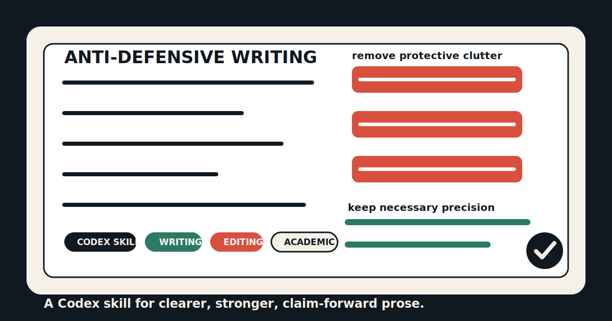

<p align="center">
  
</p>

# Anti-Defensive Writing

Anti-Defensive Writing is a Codex skill for revising prose that over-protects itself: unnecessary caveats, disclaimers, hedges, apology-like framing, negative self-limiting claims, and explanations added only to preempt imagined objections.

It keeps necessary scope and methodological precision, but makes the default posture direct, confident, and claim-forward.

## Use It For

- Academic papers, essays, abstracts, introductions, contributions, discussions, and conclusions
- Grant writing, policy writing, professional reports, and technical explanations
- Drafts that should become clearer, stronger, more concise, less apologetic, or less caveated

## Example

Defensive:

> This paper is not intended to provide a comprehensive theory of platform governance, but rather to examine one specific mechanism.

Stronger:

> This paper identifies a mechanism through which platform governance reshapes participation.

## Install

Clone the repository:

```bash
git clone https://github.com/Kiterlin/anti-defensive-writing.git
```

Install the skill into Codex:

```bash
mkdir -p ~/.codex/skills
cp -R anti-defensive-writing/skill/anti-defensive-writing ~/.codex/skills/
```

Restart Codex so the skill list reloads.

## Use

Invoke it explicitly:

```text
Use $anti-defensive-writing to revise this paragraph.
```

Or ask for the same behavior naturally:

```text
Make this abstract clearer, stronger, and less defensive.
```

## Repository Layout

```text
.
|-- README.md
|-- assets/
|   `-- cover.svg
`-- skill/
    `-- anti-defensive-writing/
        |-- SKILL.md
        `-- agents/
            `-- openai.yaml
```

The installable Codex skill is in `skill/anti-defensive-writing/`.

## Validate

If you have Codex's skill-creator system skill installed, validate with:

```bash
python3 ~/.codex/skills/.system/skill-creator/scripts/quick_validate.py skill/anti-defensive-writing
```

Expected output:

```text
Skill is valid!
```

## License

MIT
