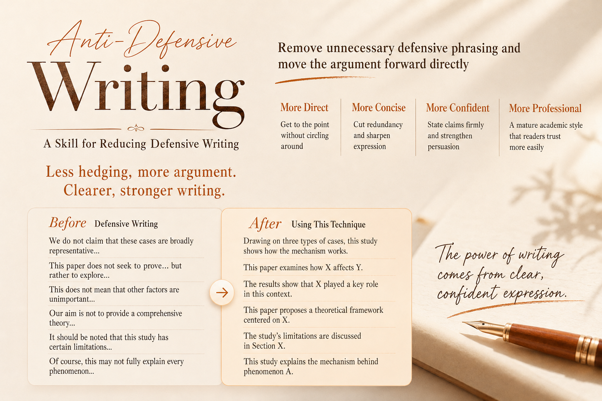

<p align="center">
  
</p>

<h1 align="center">Anti-Defensive Writing</h1>

<p align="center">
  <strong>Write with authority, directness, and precision.</strong><br>
  An open agent skill and prompt standard to eliminate excessive hedging, apologies, and defensive caveats in academic and professional prose.
</p>

<p align="center">
  <a href="README.zh-CN.md">🇨🇳 中文说明</a>
  ·
  <a href="#-the-problem-what-is-defensive-writing">The Problem</a>
  ·
  <a href="#-core-principles">Core Principles</a>
  ·
  <a href="#-before--after-showcase">Showcase</a>
  ·
  <a href="#-examples">Examples</a>
  ·
  <a href="#-quick-install--setup">Installation</a>
  ·
  <a href="#-how-to-use">How to Use</a>
</p>

<p align="center">
  <a href="https://github.com/Kiterlin/anti-defensive-writing/actions/workflows/ci.yml"></a>
  <a href="https://github.com/Kiterlin/anti-defensive-writing/stargazers"></a>
  
  
  
</p>

---

## 🎯 The Problem: What is Defensive Writing?

When writing academic papers, research proposals, or professional briefs, authors frequently anticipate reviewer objections, misunderstandings, or edge cases by over-protecting their arguments. This leads to **defensive writing**:

- Opening contributions with self-limiting disclaimers (*"While we do not claim to solve..."*).
- Stacking weak modal hedges (*"might cautiously suggest that X could potentially..."*).
- Explaining what the paper does **not** do instead of what it **does**.
- Diluting core insights with apologetic caveats before stating evidence.

**Anti-Defensive Writing** transforms hesitant, over-caveated drafts into direct, claim-forward, and authoritative prose—while rigorously preserving necessary methodological constraints, scientific precision, and analytical boundaries.

---

## ⚖️ Common Patterns & Revision Directions

| Defensive Pattern (Discouraged) | Claim-Forward Pattern (Preferred) |
| :--- | :--- |
| **Preemptive Apology**<br>*"This paper does not claim to offer a complete theory..."* | **Direct Contribution**<br>*"This paper identifies the key mechanism governing..."* |
| **Starting with Limitations**<br>*"Although our sample is restricted to 50 nodes..."* | **Leading with Findings**<br>*"Across 50 test nodes, our system improves latency by 34%..."* |
| **Stacked Modal Hedging**<br>*"The data may potentially indicate that X might influence Y."* | **Calibrated Evidence Strength**<br>*"The empirical evidence demonstrates that X influences Y."* |
| **Negative Framing**<br>*"We do not argue that policy alone determines outcomes."* | **Positive Analytical Interaction**<br>*"Implementation outcomes depend on policy and administrative capacity."* |

---

## 💡 Core Principles

1. **Lead with the Claim**: Open paragraphs with your core insight or discovery, not an anticipatory defense.
2. **Define Scope Positively**: Explicitly state what the study examines, analyzes, and contributes rather than listing what it ignores.
3. **Preserve Legitimate Precision**: Keep real constraints (sample limits, assumptions, scope bounds) in their proper analytical sections (Methods / Limitations) rather than scattering them across abstracts and introductions.
4. **Calibrate Evidence, Not Apologies**: Express uncertainty through objective empirical boundaries, not through timid language.

---

## 🔍 Before & After Showcase

### 1. Academic Paper Introduction

> **Defensive:**<br>
> *This paper is not intended to provide a comprehensive theory of platform governance, but rather to examine one specific mechanism.*
>
> **Direct & Stronger:**<br>
> *This paper identifies a mechanism through which platform governance reshapes participation.*

### 2. Methodological Innovation

> **Defensive:**<br>
> *While our sample cannot capture every real-world variation, we attempt to offer preliminary insights into model efficiency.*
>
> **Direct & Stronger:**<br>
> *On standard 32k-token benchmarks, SparseBlock achieves a 2.4× throughput improvement while maintaining baseline perplexity.*

### 3. Research Grant & Project Aims

> **Defensive:**<br>
> *We certainly do not expect to solve urban heat mitigation overnight, but we hope our sensor framework might be somewhat helpful.*
>
> **Direct & Stronger:**<br>
> *This project deploys a 50-node thermal sensing network to provide neighborhood-scale surface temperature predictions within 0.5°C accuracy.*

---

## 📚 Examples

Explore full paragraph-level before/after case studies in [`examples/`](examples/):
- 📄 [Academic Introduction](examples/academic-introduction.md)
- 📊 [Methods & Contributions](examples/methods-and-contributions.md)
- 📝 [Grant Proposals](examples/grant-proposal.md)

---

## 🚀 Quick Install & Setup

### 1. One-Line Install (Codex & Agent CLI)

**macOS / Linux / WSL (sh):**
```bash
curl -fsSL https://raw.githubusercontent.com/Kiterlin/anti-defensive-writing/main/install.sh | sh
```

**Windows (PowerShell):**
```powershell
irm https://raw.githubusercontent.com/Kiterlin/anti-defensive-writing/main/install.ps1 | iex
```

*Custom skills directory:*
```bash
# sh
curl -fsSL https://raw.githubusercontent.com/Kiterlin/anti-defensive-writing/main/install.sh | sh -s -- --dest <skills-dir>

# PowerShell
& ([scriptblock]::Create((irm https://raw.githubusercontent.com/Kiterlin/anti-defensive-writing/main/install.ps1))) -Dest <skills-dir>
```

---

### 2. Universal Setup for Web AI & Code Editors

#### 💬 ChatGPT / Claude Web (Custom Instructions / Projects)
Paste this into your **Custom Instructions**, **System Prompt**, or **Project Knowledge**:

```text
You are an expert editor specializing in Anti-Defensive Writing.
When revising academic or professional text:
1. Identify and eliminate defensive writing: unnecessary caveats, preemptive apologies, excessive modal hedging (may, might, could, potentially), and negative self-limiting statements.
2. Lead with primary claims, contributions, and findings.
3. Preserve necessary scientific precision, methodological constraints, and scope limitations, placing them in their proper analytical context without apologetic framing.
4. Keep the prose direct, active, and claim-forward.
```

#### 💻 Cursor / Windsurf (`.cursorrules` / `.windsurfrules`)
```markdown
# Anti-Defensive Writing Rules
- When writing or editing documentation, papers, or proposals, avoid defensive writing patterns.
- Remove redundant disclaimers and hesitant hedging while preserving exact technical and methodological precision.
- Follow the guidelines in SKILL.md.
```

#### 🛠️ Claude Code / CLI Agents (`CLAUDE.md`)
```markdown
## Writing Style
- Apply Anti-Defensive Writing: write directly, state contributions first, and avoid apologetic caveats or vague hedges.
```

---

## 📖 How to Use

### Step 1: Audit & Identify Issues
Ask your AI agent to diagnose defensive writing patterns in your draft:
```text
$anti-defensive-writing Please review my draft and identify every instance of defensive writing, unnecessary caveats, and excessive hedging.
```

### Step 2: Review Findings
Review the highlighted points. Differentiate between **unnecessary defensive padding** and **essential methodological scope conditions**.

### Step 3: Revise with Precision
Apply the anti-defensive rewrite pass:
```text
$anti-defensive-writing Based on the issues identified above, revise these paragraphs to make them direct and claim-forward while maintaining methodological precision.
```

---

## 📂 Repository Layout

```text
.
|-- SKILL.md                 # Primary skill definition & prompt rules
|-- README.md                # English documentation
|-- README.zh-CN.md          # Chinese documentation
|-- install.sh               # Unix installation script
|-- install.ps1              # Windows PowerShell installation script
|-- skill.json               # Package metadata for skill package managers
|-- agents/
|   `-- openai.yaml          # Agent configuration
|-- assets/
|   |-- cover-en.png         # English banner cover image
|   `-- cover-zh-cn.png      # Chinese banner cover image
|-- examples/                # Real-world paragraph case studies
|   |-- academic-introduction.md
|   |-- grant-proposal.md
|   `-- methods-and-contributions.md
`-- skill/
    `-- anti-defensive-writing/
        |-- SKILL.md         # Mirrored clean installable skill
        `-- agents/
            `-- openai.yaml
```

---

## 🧪 Validation

Verify skill metadata and mirror consistency:

```bash
# JSON validation
python3 -c "import json; json.load(open('skill.json'))"

# Mirror consistency check
diff -u SKILL.md skill/anti-defensive-writing/SKILL.md
diff -u agents/openai.yaml skill/anti-defensive-writing/agents/openai.yaml
```

---

## 📄 License

Distributed under the [MIT License](LICENSE).
