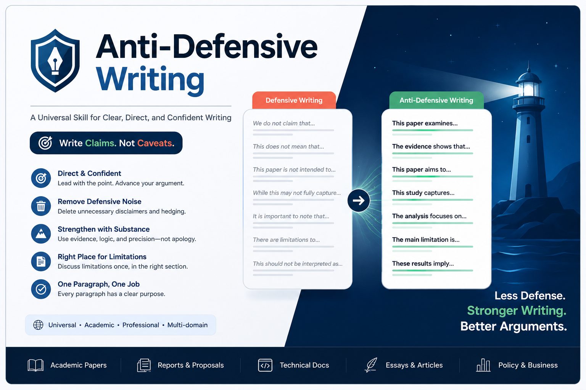

<p align="center">
  
</p>

<h1 align="center">Anti-Defensive Writing</h1>

<p align="center">
  一个用于审查和修改防御性写作的 Codex skill。
</p>

<p align="center">
  <a href="README.md">English README</a>
  ·
  <a href="#安装">安装</a>
  ·
  <a href="#使用方法">使用方法</a>
  ·
  <a href="#示例">示例</a>
</p>

<p align="center">
  
  
  
  
</p>

---

## 它解决什么问题

防御性写作会让论文和专业文本过度预判反对意见、边界情况、读者误解或审稿批评，于是加入不必要的 caveat、免责声明、犹豫表达、自我限制和过度解释。

Anti-Defensive Writing 的目标是让文本更直接、更清楚、更有论证姿态，同时保留真正必要的研究范围、方法限制、法律伦理限制和准确性说明。

| 常见问题 | 修改方向 |
| --- | --- |
| 反复说明“本文不声称……” | 改成正面说明本文研究什么、解释什么、贡献什么 |
| 贡献段先写限制 | 先给出核心贡献，把必要限制放到合适位置 |
| 过度使用 may, could, potentially | 用更精确的证据范围和判断强度 |
| 用长 caveat 保护一句简单论点 | 删除不增加准确性的防御性解释 |

## 适用场景

| 类型 | 典型文本 |
| --- | --- |
| 学术写作 | 论文、摘要、引言、贡献段、讨论、结论 |
| 申请与报告 | Essay、研究计划、基金申请、政策文本、专业报告 |
| 专业表达 | 技术解释、产品文案、说明性文字 |

## 示例

**防御性写法**

> This paper is not intended to provide a comprehensive theory of platform governance, but rather to examine one specific mechanism.

**更强的写法**

> This paper identifies a mechanism through which platform governance reshapes participation.

## 安装

### 一行安装

安装到 Codex 默认 skills 目录：

```bash
curl -fsSL https://raw.githubusercontent.com/Kiterlin/anti-defensive-writing/main/install.sh | sh
```

安装到其他 agent 工具时，传入它的 skills 父目录：

```bash
curl -fsSL https://raw.githubusercontent.com/Kiterlin/anti-defensive-writing/main/install.sh | sh -s -- --dest <skills-dir>
```

常用示例：

```bash
curl -fsSL https://raw.githubusercontent.com/Kiterlin/anti-defensive-writing/main/install.sh | sh -s -- --dest ~/.codex/skills
curl -fsSL https://raw.githubusercontent.com/Kiterlin/anti-defensive-writing/main/install.sh | sh -s -- --dest ~/.local/share/agent/skills
```

### 使用 Codex Skill Installer

如果你的 Codex 带有 `skill-installer` 系统 skill，可以直接从 GitHub 安装：

```bash
python3 ~/.codex/skills/.system/skill-installer/scripts/install-skill-from-github.py \
  --repo Kiterlin/anti-defensive-writing \
  --path skill/anti-defensive-writing
```

### 让 AI 帮你安装

如果你不确定自己的工具把 skills 放在哪里，可以直接让 AI 帮你安装：

```text
请帮我从 GitHub 安装这个 skill：
https://github.com/Kiterlin/anti-defensive-writing

请先判断我当前 agent 工具的 skills 目录在哪里，然后 clone 这个仓库，把 skill/anti-defensive-writing 复制到对应的 skills 目录。如果这个工具要求 skill 位于仓库根目录，就使用仓库根目录的 SKILL.md。不要复制 logs、cache 或无关文件。
```

### 手动安装

克隆仓库：

```bash
git clone https://github.com/Kiterlin/anti-defensive-writing.git
```

安装到 Codex：

```bash
mkdir -p ~/.codex/skills
cp -R anti-defensive-writing/skill/anti-defensive-writing ~/.codex/skills/
```

安装到其他 agent 工具：

```bash
cp -R anti-defensive-writing/skill/anti-defensive-writing <skills-dir>/
```

安装后重启 agent，让它重新加载 skills。

## 使用方法

### 1. 先审查

使用 `$anti-defensive-writing` 审查论文是否存在防御性写作。

```text
$anti-defensive-writing 请审查我的论文，列出其中存在的防御性写作问题。
```

### 2. 再过目

AI 列出所有存在的问题后，先逐条过目一遍。重点确认哪些问题确实需要修改，哪些限制说明属于研究范围、方法透明度或论证准确性所必需的内容。

### 3. 最后修改

根据以上分析，使用 `$anti-defensive-writing` 修改论文中存在防御性写作的段落和语句。

```text
$anti-defensive-writing 请根据刚才列出的问题，修改这些段落和语句，去掉不必要的防御性写作，同时保留必要的研究范围和方法限制。
```

## 仓库结构

```text
.
|-- SKILL.md
|-- README.md
|-- README.zh-CN.md
|-- install.sh
|-- skill.json
|-- agents/
|   `-- openai.yaml
|-- assets/
|   `-- cover.png
`-- skill/
    `-- anti-defensive-writing/
        |-- SKILL.md
        `-- agents/
            `-- openai.yaml
```

干净的可安装 skill 位于 `skill/anti-defensive-writing/`。

仓库根目录也保留了 `SKILL.md` 和 `agents/openai.yaml`，供只识别 GitHub 仓库根目录的 agent 工具使用。

`skill.json` 是机器可读 metadata，记录 skill 路径、入口文件、仓库地址和通用安装命令。

## 校验

如果你本地有 Codex 的 `skill-creator` 系统 skill，可以运行：

```bash
python3 ~/.codex/skills/.system/skill-creator/scripts/quick_validate.py skill/anti-defensive-writing
```

预期输出：

```text
Skill is valid!
```

## License

MIT
