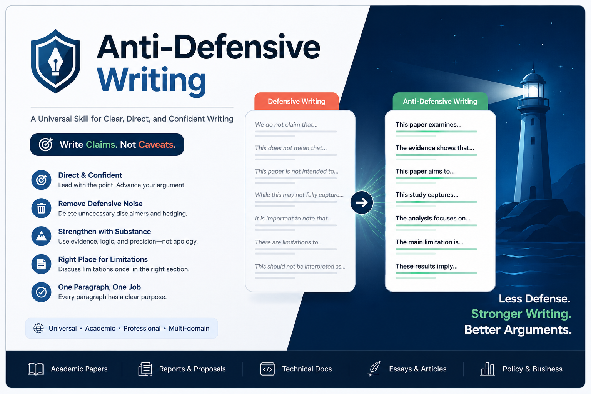

<p align="center">
  
</p>

<h1 align="center">Anti-Defensive Writing（去防御性写作）</h1>

<p align="center">
  <strong>以坚定、直接、精准的姿态写作。</strong><br>
  开源 AI Agent 技能与提示词规范，专用于消除学术论文、课题申报与专业写作中冗余的犹豫措辞、辩解式免责与消极自我限制。
</p>

<p align="center">
  <a href="README.md">🌐 English README</a>
  ·
  <a href="#-痛点解析什么是防御性写作">痛点解析</a>
  ·
  <a href="#-核心写作原则">核心原则</a>
  ·
  <a href="#-经典案例对比">案例对比</a>
  ·
  <a href="#-详细案例库">案例库</a>
  ·
  <a href="#-快速安装与接入">快速安装</a>
  ·
  <a href="#-使用流程">使用流程</a>
</p>

<p align="center">
  <a href="https://github.com/Kiterlin/anti-defensive-writing/actions/workflows/ci.yml"></a>
  <a href="https://github.com/Kiterlin/anti-defensive-writing/stargazers"></a>
  
  
  
</p>

---

## 🎯 痛点解析：什么是防御性写作？

在撰写学术论文、研究提案或专业报告时，作者往往出于对审稿人批评、读者误解或边界特例的过度担忧，而在论述中层层设防。这种**防御性写作（Defensive Writing）**会导致文稿冗长、气势减弱且重点模糊：

- **以自我限制开篇**：在阐述创新前先声明无力解决的问题（如*“虽然本文无意提供完整的理论体系……”*）。
- **层叠模糊犹豫词**：连续使用 *“可能、或许、在某种程度上潜在影响……”*，大幅削弱论证力度。
- **消极否定式阐述**：频繁解释文章**不是**什么，而不是清晰阐明文章**提出**了什么。
- **分散论证重点**：在引言或结论中过早、过度堆叠道歉式免责，掩盖了核心证据与贡献。

**Anti-Defensive Writing** 帮助作者将犹豫不决的防卫性初稿转化为**论点鲜明、逻辑自信、直奔主题**的专业文本，同时严谨保留方法论、数据范畴和伦理安全所必需的客观精度。

---

## ⚖️ 常见模式与修改方向

| 常见防御性模式（不推荐） | 去防御性改写方向（推荐） |
| :--- | :--- |
| **预设辩解式免责**<br>*“本文无意提供一套完整的平台治理理论，仅旨在探讨其中某一机制。”* | **直陈核心贡献**<br>*“本文阐明了平台治理重塑用户参与的机制。”* |
| **以局限性作为段落开篇**<br>*“尽管样本有限、无法覆盖所有变异，但仍有一定参考价值。”* | **正面界定范围**<br>*“样本覆盖了与理论问题最相关的变异。”* |
| **犹豫词层叠堆砌**<br>*“这或许表明 X 有可能影响 Y。”* | **按证据定标**<br>*“现有证据表明，在这些案例中 X 影响 Y。”* |
| **消极否定式框架**<br>*“这并不意味着政策设计单独决定执行结果。”* | **改成正面表述**<br>*“执行结果取决于政策设计与行政能力如何交互。”* |

---

## 💡 核心写作原则

1. **核心论点先行（Lead with the Claim）**：段落以核心发现或主张切入，拒绝以辩解性铺垫开头。
2. **正面界定范围（Positive Scope）**：直接阐明研究“分析了什么、解释了什么、对比了什么”，而非反复声明“没做什么”。
3. **保留必要精度（Preserve Precision）**：真实的方法约束、样本边界与假设条件，应客观放置于研究方法（Methods）或局限性讨论（Limitations）章节中，避免在摘要与引言中零散道歉。
4. **以证据定标，而非以道歉减压**：通过客观的数据边界与逻辑论证界定结论范围，而非依赖虚弱的犹豫词。

---

## 🔍 经典案例对比

### 1. 学术论文引言（Academic Introduction）

> **防御性写法：**<br>
> *尽管这项有限的研究无力解决平台治理的长期争论，自动关键词过滤或许有可能使活跃贡献者的自愿回复减少 14%。*
>
> **论点先行：**<br>
> *自动关键词过滤使活跃贡献者的自愿回复减少 14%。*

### 2. 方法创新与实验对比（Methods & Contributions）

> **防御性写法：**<br>
> *我们并不宣称 SparseBlock 在所有基准上都更优，但它或许能在标准 32k-token 测试中带来一定的 2.4 倍吞吐提升。*
>
> **论点先行：**<br>
> *在标准 32k-token 基准上，SparseBlock 将吞吐提高 2.4 倍。*

### 3. 课题申报与研究目标（Grant Proposals）

> **防御性写法：**<br>
> *我们当然不期望一举解决城市热岛问题，但希望 50 个节点或许能提供精度约 0.5°C 的街区温度预测。*
>
> **论点先行：**<br>
> *本项目布设 50 个传感节点，提供精度 0.5°C 的街区级地表温度预测。*

---

## 📚 详细案例库

完整段落案例见 [`examples/`](examples/)（目前为英文）。每则草稿已包含研究结果与限制条件；改写只调整表述，不增加新证据。
- 📄 [学术论文引言案例](examples/academic-introduction.md)
- 📊 [研究方法与创新论述案例](examples/methods-and-contributions.md)
- 📝 [课题申报与项目规划案例](examples/grant-proposal.md)

---

## 🚀 快速安装与接入

### 1. 一键安装（Codex / CLI Agent 环境）

**macOS / Linux / WSL (sh):**
```bash
curl -fsSL https://raw.githubusercontent.com/Kiterlin/anti-defensive-writing/main/install.sh | sh
```

**Windows (PowerShell):**
```powershell
irm https://raw.githubusercontent.com/Kiterlin/anti-defensive-writing/main/install.ps1 | iex
```

*自定义目标安装路径：*
```bash
# sh
curl -fsSL https://raw.githubusercontent.com/Kiterlin/anti-defensive-writing/main/install.sh | sh -s -- --dest <skills-dir>

# PowerShell
& ([scriptblock]::Create((irm https://raw.githubusercontent.com/Kiterlin/anti-defensive-writing/main/install.ps1))) -Dest <skills-dir>
```

---

### 2. Web 端与其他 Agent 快速接入

#### 💬 ChatGPT / Claude 网页端（自定义指令 / Projects）
将以下提示词复制到 **Custom Instructions（自定义指令）**、**System Prompt（系统提示词）** 或 **Project Knowledge（项目知识库）** 中：

```text
按「去防御性写作（Anti-Defensive Writing）」规则审阅或修改学术与专业文本：
1. 给每句防御性表述分类：不必要的免责、必要的范围条件、真实的方法限制、有用的概念对照、基于证据的限定，或重复说明。
2. 删掉不增加证据、范围或必要说明的免责。
3. 先写主张。将其余限制改成正面范围。真实约束只保留一次，放在合适位置，不要写成道歉。
4. 用可核对的精度替换犹豫。不要在原稿之外增加发现、数字或方法。
```

#### 💻 Cursor / Windsurf 编辑器（`.cursorrules` / `.windsurfrules`）
在项目根目录的 `.cursorrules` 或 `.windsurfrules` 中添加。这段规则自身完整，项目里不需要再放 `SKILL.md`。

```markdown
# 去防御性写作（Anti-Defensive Writing）
撰写或修改论文、方案或文档时：
- 直接陈述主张，不要以「本文不声称 / 不试图」开篇。
- 先给每条免责分类，再决定删留。影响效度、解释、适用范围、设计或误用的限制要保留。
- 删掉不增加证据、范围或必要说明的免责。
- 将其余限制改成正面范围；用可核对的精度替换犹豫。
- 不要在草稿之外增加新的发现、数字或方法。
```

#### 🛠️ Claude Code / CLI Agent（`CLAUDE.md`）
在项目的 `CLAUDE.md` 中添加：

```markdown
## 写作风格
- 遵循去防御性写作：主张先行，删掉不必要的免责，真实方法限制只保留一次、写清楚即可。
- 不要在原稿之外增加新的发现。
```

---

## 📖 使用流程

分两轮交给模型。两轮之间由你核对哪些限制必须留下。

`$anti-defensive-writing` 是**技能加载前缀**（Codex、Claude Code 等）。若只是把提示词贴进 ChatGPT、Claude 网页端、Cursor 或 Windsurf，用普通对话发送同样的请求，不要加这个前缀。

### 第 1 步：分类

```text
请审查这份草稿。给每句防御性表述分类：不必要的免责、必要的范围条件、真实的方法限制、有用的概念对照、基于证据的限定，或重复说明。并列出那些只削弱主张、并不增加准确性的犹豫措辞。
```

已安装技能：在请求前加 `$anti-defensive-writing`。只粘贴了提示词：按普通消息发送。

### 第 2 步：核对清单

限制若影响效度、解释、适用范围、研究设计，或读者能否正确使用结果，就保留。其余删掉。

### 第 3 步：改写

```text
请根据上面的分类，改写这些段落，使主张直接、先行。保留必要的方法限制。不要在草稿之外增加发现、数字或方法。
```

已安装技能：在请求前加 `$anti-defensive-writing`。只粘贴了提示词：作为普通后续消息发送。

---

## 📂 仓库结构

```text
.
|-- SKILL.md                 # 核心 Skill 规则定义与提示词标准
|-- README.md                # 英文说明文档
|-- README.zh-CN.md          # 中文说明文档
|-- install.sh               # Unix/macOS 安装脚本
|-- install.ps1              # Windows PowerShell 安装脚本
|-- skill.json               # Skill 规范元数据
|-- agents/
|   `-- openai.yaml          # Agent 配置文件
|-- assets/
|   `-- cover.png            # 封面图片
|-- examples/                # 实战段落案例库
|   |-- academic-introduction.md
|   |-- grant-proposal.md
|   `-- methods-and-contributions.md
`-- skill/
    `-- anti-defensive-writing/
        |-- SKILL.md         # 镜像纯净版 Skill
        `-- agents/
            `-- openai.yaml
```

---

## 🧪 验证与测试

验证元数据完整性与镜像文件一致性：

```bash
# JSON 语法验证
python3 -c "import json; json.load(open('skill.json'))"

# 镜像文件一致性校验
diff -u SKILL.md skill/anti-defensive-writing/SKILL.md
diff -u agents/openai.yaml skill/anti-defensive-writing/agents/openai.yaml
```

---

## 📄 开源许可

本项目遵循 [MIT License](LICENSE) 开源协议。
